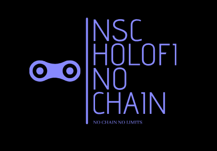

Claro! Aqui está a versão atualizada do README, com Java e TypeScript adicionados, SQL incluído, e Go removido:

---

## 🔱🌎 HOLLOW V8🌎 🔱


### Description:
HOLLOW V8 is an advanced blockchain platform designed to facilitate decentralized applications (DApps) and digital asset management. It integrates a range of cutting-edge technologies to ensure secure and efficient tokenization, transactions, and smart contract operations.

### Key Features:
- **Customizable Digital Assets**: Create and manage digital assets on the HOLLOW V8 blockchain.
- **Secure Transfers**: Efficient and secure transfer and verification of digital assets.
- **Planetary Integration**: Advanced functionalities with a focus on Earth and Space integration.
- **Quantum Computing**: Capabilities for hybrid digital asset creation and quantum computing integration.
- **Enhanced by Horigami FX**: Advanced tokenization mechanics, security protocols, scalability, and interoperability.

### Prerequisites:
- Node.js installed on your machine.
- HOLLOW V8 client configured and synchronized with the network.
- Basic knowledge of Java, TypeScript, RubyX, JavaScript, Shell, SQL, and CMake for smart contract development.
- Internet connection for interaction with the HOLLOW V8 blockchain.

### Usage Instructions:

1. **Cloning the Repository:**
   ```sh
   git clone https://github.com/your-username/hollow-v8-dapp.git
   ```

2. **Installing Dependencies:**
   ```sh
   cd hollow-v8-dapp
   npm install
   ```

3. **Configuring the HOLLOW V8 Network:**
   - Ensure your HOLLOW V8 client is operational and synced.
   - Set up environment variables in the `.env` file with your HOLLOW V8 network details.

4. **Deploying Smart Contracts:**
   - Compile and deploy smart contracts on the HOLLOW V8 blockchain as required.
   - Update contract addresses in the configuration files (`config.js`, etc.) post-deployment.

5. **Running the DApp:**
   ```sh
   npm start
   ```

6. **Interacting with HOLLOW V8 DApp:**
   - Utilize provided REST API endpoints to manage digital assets and execute transactions.
   - Digital assets are represented as customizable tokens on the HOLLOW V8 blockchain.

### Planetary Integration:
HOLLOW V8 integrates advanced functionalities with a focus on Earth and Space, enhancing security, transparency, and computational efficiency for DApps.

### Quantum Computing with Hybrid Asset Creation:
HOLLOW V8 integrates innovative solutions for hybrid digital asset creation and quantum computing, pushing the frontiers of decentralized applications and digital asset management.

---

### Conclusion

HOLLOW V8 is at the cutting edge of blockchain technology, providing a robust platform for decentralized applications and digital asset management. With advanced integrations like planetary functionalities and quantum computing capabilities, HOLLOW V8 is set to redefine the blockchain landscape.

For more information, visit [HOLLOW V8](https://nscio.vercel.app/)

<p>FOUNDER: LUCAS JANAURIO DO NASCIMENTO</p>



---
